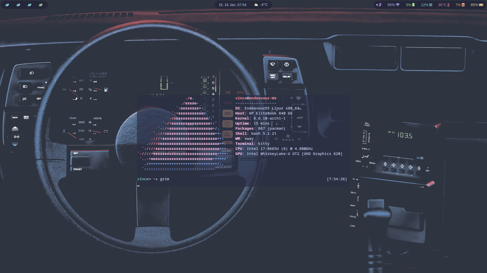
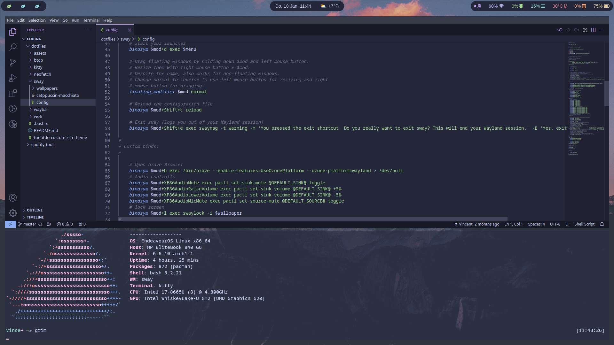
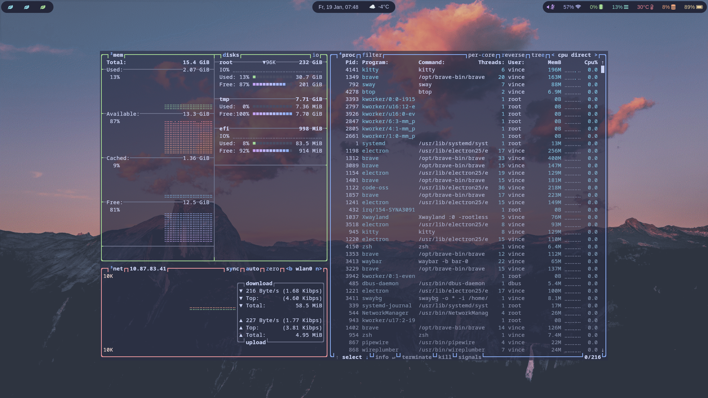

# dotfiles
This is my desktop environment using endeavour OS with swayWM.
For the specifics on each programm check the coresponding folders.

> If you have questions running this configuration feel free to open an issue. *But this is a personalized config working on my machine so i can not help you everytime*

I have a few wallpapers under [/sway/wallpapers](sway/wallpapers/).
In the screenshots i am using [ign_mountains](sway/wallpapers/ign_mountains.png) and [ign_car](sway/wallpapers/ign_car.png).

## Images

